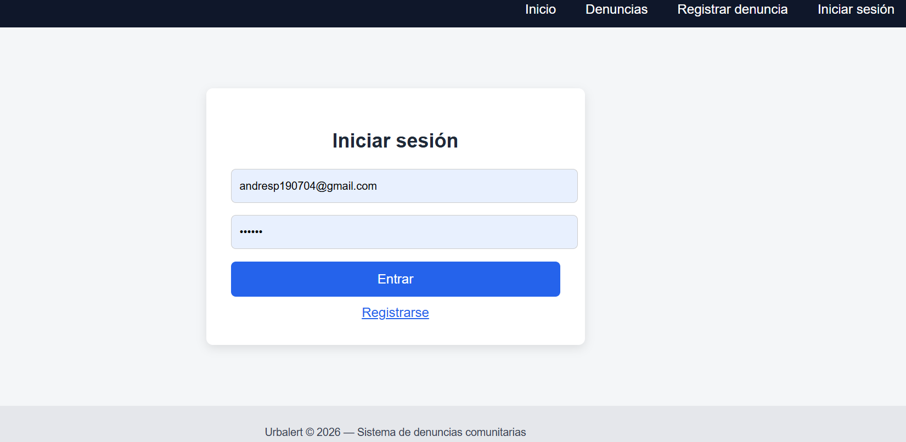
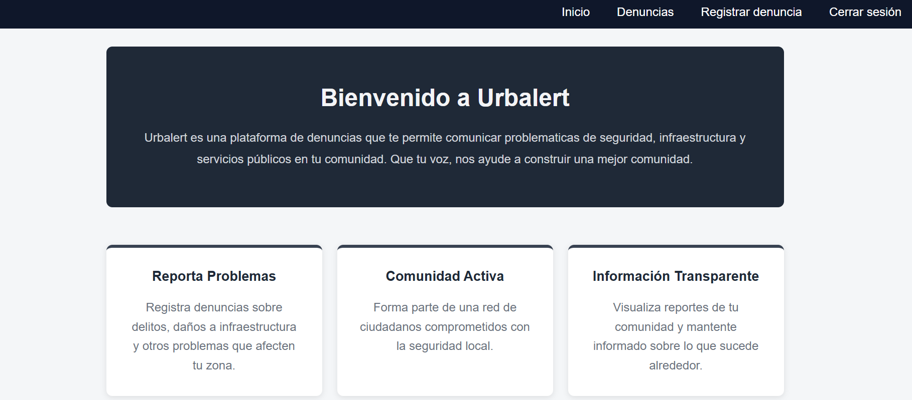
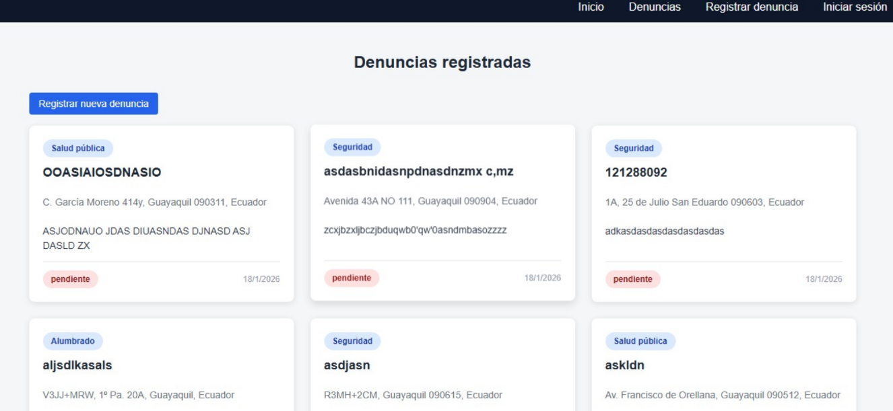
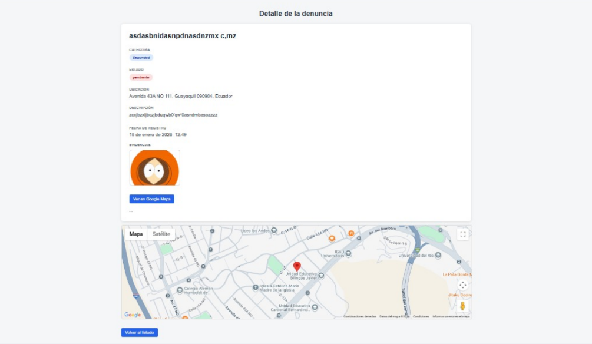
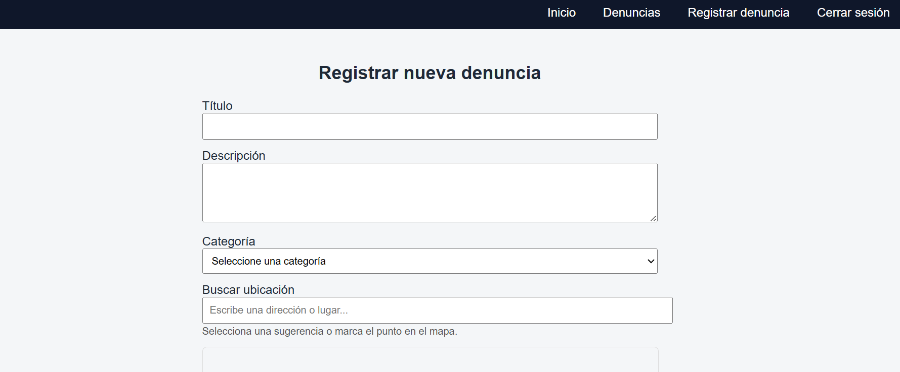

<h1 align="center">UrbAlert</h1>

<strong>Plataforma de denuncias ciudadanas</strong>

---
 
<h2 align="center">Acerca de UrbAlert</h2>

Es una plataforma de  denuncias para la comunidad, desarrollada en "Laravel". Este proyecto permite a la ciudadanía registrar, visualizar y  editar denuncias.

La plataforma cuenta con un sistema de autenticación, que permite visualizar las denuncias sin necesidad de iniciar sesión. Sin embargo, para registrar una denuncia se debe iniciar sesion y la misma solo podra ser editada por el usuario que realizo la denuncia.

Como funciones extra, se pueden añadir imágenes a la denuncia para respaldar la información e incluir la dirección del suceso para su seguimiento.

---

<h2 align="center">Tecnologías utilizadas</h2>

- Blade Templates (Laravel)
- sqlite3 || 3.50.3 
- PHP || 8.4.16
- Laravel || 12.47.0
- Composer || 2.9.3
- Vite || 7.3.1
- npm  || 11.6.2
- Node || 24.12.0

---

<h2 align="center">Requisitos minimos</h2>

- V. PHP >= 8.1
- Composer Composer >= 2.0
- Node.js >= 18
- npm  >= 9
- Sqlite 3
- Git 

---

<h2 align="center">¿Como ejecutar el programa?</h2>

1. Clonamos el repositorio

git clone https://github.com/OwuenYagual/urbalert
cd urbalert

2. Configuramos los archivos necesarios

2.1 Archivo .env

- Configuramos el archivo .env, verificamos las variables:

APP_NAME=UrbAlert
APP_ENV=local
APP_DEBUG=true
APP_URL=http://127.0.0.1:8000

DB_CONNECTION=sqlite

- Creamos la base de datos
touch database/database.sqlite

- Creamos la key
php artisan key:generate

3. Abrimos dos terminales

3.1 En el primer terminal usamos composer y php

composer install
php artisan migrate

3.2 En el segundo terminal usamos npm

npm install
npm run dev

3.3 Volvemos al primer terminal y ejecutamos
php artisan serve

4. Ingresa a la dirección http://127.0.0.1:8000

5. Nos desplazamos entre las vistas de la plataforma

---

<h2 align="center">Vista previa</h2>

#### Login

#### Inicio

#### Denuncias

#### Vista detallada

#### Registrar denuncias

---

<h2 align="center">Pruebas</h2>

1. Iniciar sesion
2. Registrar sesion
3. Observar denuncias
4. Registrar denuncia
5. Editar denuncia
6. Cerrar sesion

---

<h2 align="center">Secciones mas importantes</h2>

routes/web.php -> Rutas del sistema
resources/views -> Se encuentran los .blade.php
app/Http/Controllers-> Se encuentrar los archivos Controllers

---

<h2 align="center">Autores</h2>

- **Owen Yagual**  
  Estudiante de Ingeniería en Computación

- **Andrés Eduardo Pino González**  
  Estudiante de Ingeniería en Computación

